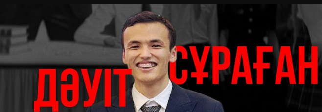

# ISSAI Playground: Personal AI Assistants & Voice Service Integration

ISSAI Playground is a Python-based framework that integrates Oylan 2 API, MangiSoz (SoyleTTS, SoyleSTT), Beynele Text-to-Image, and other services. With this platform, you can easily build Telegram bots, voice assistants, and multimodal AI solutions.

## Quick Start

### Requirements

- Python 3.9+
- Install required packages:

```bash
pip install -r requirements.txt
```

### Setup & Configuration

1. Create a `.env` file and add your API keys:

```env
API_OYLAN=<Oylan API Key>
API_SOYLE=<Soyle API Key>
API_MAIN=<accessToken>
```

> **How to get `accessToken`:**
> 1. Go to https://mangisoz.nu.edu.kz/soyle or https://beynele.nu.edu.kz/beynele, https://oylan.nu.edu.kz/oylan
> 2. Press F12 → Application → Cookies → Copy the value of `accessToken`

2. Configure your assistant in `config.py`:

```python
ASSISTANT_ID = 'your_assistant_id'
```

## Examples & Usage

- **Assistant creation, update, info:**
  - `oylan/assistant/create.py`
  - `oylan/assistant/update.py`
  - `oylan/assistant/get_info.py`
  - `oylan/assistant/models_list.py` — list available models

- **Context management:**
  - `oylan/contexts/add_context.py` — add context
  - `oylan/contexts/get_context.py` — get context info
  - `oylan/contexts/delete_context.py` — delete context

- **Voice processing:**
  - `soyle/auto_detected.py` — language detection (langid)
  - `soyle/transcription.py` — speech-to-text

- **Soyle TTS:**
-----
<table>
<tr>
<td align="center">
    
**Famale Voice**
</td>
<td align="center">
    
**Male Voice**
</td>
</tr>

<tr>
<td align="center">

[output_audio.webm](https://github.com/user-attachments/assets/e4e78b48-e46e-4b0e-81cf-d4b721b5a981)

</td>
<td align="center">
  
[input_audio.webm](https://github.com/user-attachments/assets/065313f3-408f-4b8e-b46c-04364403f454)

</td>
</tr>
</table>


  - `soyle/tts.py` — text-to-speech

- **Image generation:**
<p align="center">
  
</p>

<p align="center"><i>Bayterek monument in Astana, cyberpunk style</i></p>

  - 📄 Script:`beynele/beynele.py` — text-to-image

- **OCR (Optical Character Recognition)**
<p align="center">  </p> 

<p align="center"><i>Text recognition example</i></p>

  - 📄 Script: `ocr/ocr.py` — image-to-text converter
  Extracts text from an uploaded image using the Mangisoz OCR API.
  ```python
  Example output:
  🔍 OCR Result:
  {'text': 'дәуіт\nсұраған', 'audio': '', 'uid': '5f6fc063-885a-4b6a-8256-2dd739983db8.png'}
  ```

## Contact

- https://t.me/dake_dev
- https://t.me/davidsuragan

## Credits
- https://oylan.nu.edu.kz/login
- https://mangisoz.nu.edu.kz
- https://beynele.nu.edu.kz/login

## License
MIT License
